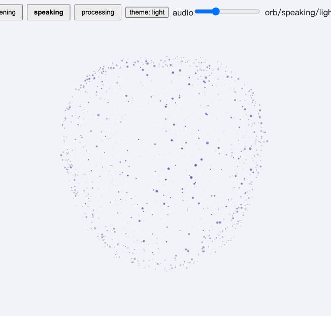
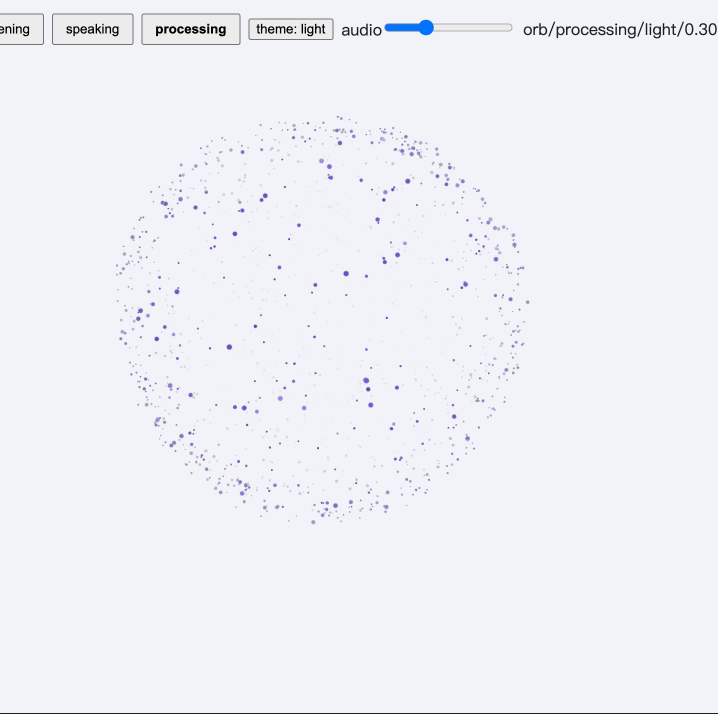

# Jarvis Voice Visuals Demo

Jarvis 语音聊天动画的独立演示项目，不依赖主工程，可单独运行。

包含两种可切换的视觉效果，各自响应四种语音状态（等待 idle / 聆听 listening / 回答 speaking / 思考 processing）：

- **粒子星球 orb** — WebGL 点精灵渲染的球面粒子云（Fibonacci 均匀分布，约 1200 粒子）。
  聆听态随音量膨胀震动，思考态湍流搅动，回答态波纹扫过球面；鼠标划过时粒子沿法线排斥扩散。
- **点阵 matrix** — SVG 圆点矩阵（17×17），等待脉冲环 / 聆听 VU 柱 / 回答横波 / 思考径向波。

## 运行

```bash
npm install
npm start        # 启动 dev server 并监听 http://127.0.0.1:4173
```

esbuild 的 serve 模式会在每次刷新页面时按需重新打包，改完 `src/` 里的代码刷新浏览器即可看到效果。

## 页面操作

- 第一排前两个按钮切换 orb / 点阵
- 中间四个按钮切换 等待 / 聆听 / 思考 / 回答
- `theme` 按钮切换亮 / 暗主题
- `audio` 滑块在聆听态下模拟麦克风音量（两种视觉都会响应）

## 视觉素材

`assets/` 目录包含四种语音状态的视觉参考，可用于对照演示效果或同步到产品文档中。

| 状态 | 文件 | 预览 |
| --- | --- | --- |
| 等待 idle | `assets/例子星球 idle.png` |  |
| 聆听 listening | `assets/litening.gif` |  |
| 回答 speaking | `assets/Speaking.gif` |  |
| 思考 processing | `assets/Processing.gif` |  |

## 其他命令

```bash
npm run build      # 产出压缩后的 public/bundle.js（配合 public/index.html 可静态部署）
npm run typecheck  # TypeScript 类型检查
```

## 目录结构

```
sphere-demo/
├── assets/
│   ├── 例子星球 idle.png    # 等待态视觉参考
│   ├── litening.gif         # 聆听态动画参考
│   ├── Speaking.gif         # 回答态动画参考
│   └── Processing.gif       # 思考态动画参考
├── public/
│   └── index.html            # 页面壳
├── src/
│   ├── main.tsx              # 演示页（控制面板 + 两种视觉切换）
│   ├── particle-sphere.tsx   # WebGL 粒子球组件
│   ├── particle-sphere-core.ts # 纯逻辑：球面分布 / 模式参数 / 音频平滑
│   └── matrix.tsx            # SVG 点阵组件与帧生成器
├── package.json
└── tsconfig.json
```

> 组件源文件复制自主工程 `src/components/ui/`；如果主工程组件有更新，重新复制这三个文件即可同步。
